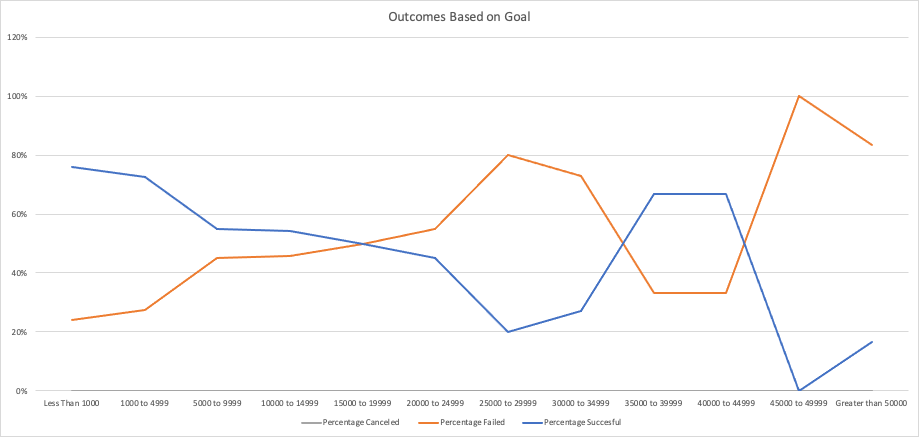
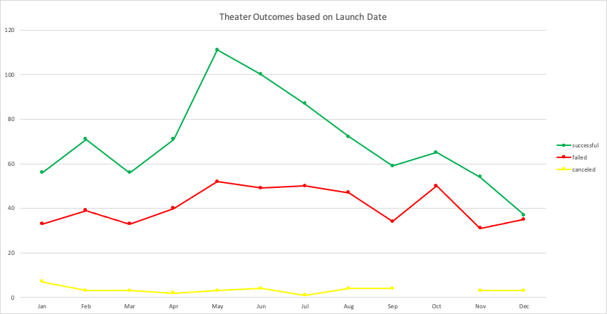

# Kickstarting with Excel 

## Overview of Project

The following report looks at data collected on Kickstarter campaigns across differnt geographical regions and categories then sumamrizes information on successful, failed, and cancelled cmapaings.

### Purpose

The purpose of this campaign was to evaluate "The Client's" campaign for *Fever*, a theater play needing funding for production, against similar campaings. Specifically, The Client needed a report regarding the success of her campaign vs. others when analyzing Luanch Date and and Launch Goals. 

## Analysis and Challenges

The campaign information, detailed in [Kickstarter_Challenge](resources/Kickstarter_Challenge.xlsx), was used to formulate the following two deliverables that assess campaign performance: Outcomes Based on Goal and Outcomes Based on Lauch Date.

### Outcomes Based on Goals - Overview of Process and Preliminary Findings

 

Goal amounts were grouped into twelve bins as dentoed by the legend on the graph above. Filtering to only observe the subcategory "plays", the total number of sucessful, failed, and canceled campaigns were calculated and then displayed as a percentage of the sum of the three outcomes - "live" campaigns were ignored in the report.

From the resulting graph, it can be concluded that campaigns:

1.) With an initial goal of <$1,0000 were the most successful (76%) 
2.) With an inital goal between $45,000 to $49,000 were the least successful (100%)

Most campaings set an intial goal between $1,000 and $4,999 and observed a high success rate, equal to 73%. By keeping a play campaign goal under $4,999, a Kickstarter would have a 74.4% chance achieving their inital goal. 

### Outcomes Based on Launch Date - Overview of Process and Preliminary Findings 

For the above graph,  outcomes (successful, failed, canceled) were totalled by month, then filtered to observe only those found in the parent category "Theater." 

Based on this data, the most sucessful month to launch a campaign is May, followed closely by June. 

### Challenges and Difficulties

While no challenges were directly encountered working with the data set, there remains the possibily that one could find this data diffcult. The date listed in the raw data are in UNIX form. Anyone unfamiliar with this format could mistake the information for another data type - accounting, currency, etc. 

Grouping goal amounts in the proper bins and having the proper range for these bins could prove torublesome for anyone unfamilar with this methodology.

## Results

Looking at the *Outcomes based on Lanchu Date*, the most successful campaings started in the late spring and early summer. Those started in May had the highest rate of success as opposed to any other month. May is also the month with the highest number of campaigns started and highest count of failed. If looking to start a campaign, the optimal time frame is between May and July.

When setting a campaign goal, it is imporant to not exceed a certain amount. A good ceiling would be $4,999. Campaigns that remained under that threshold saw the highest sucess rate. 

Depsite those two conclusions, this data set is quite limited. The following are a few aspects that were not detailed in this dataset
-Promotional methods used ot attract donors
-Location of donors
-reasons for canceling campaings
-Did failed campaigns start again with different goals?

To answer The Client's question more throuroughly, more analysis is requried. The following could also be observed to give a more detailed analysis:
1. How quickly a campaign reached its goal
2. How many backers a campaign had and information on donation amounts per backer
3. Countries with the most successful campaigns

